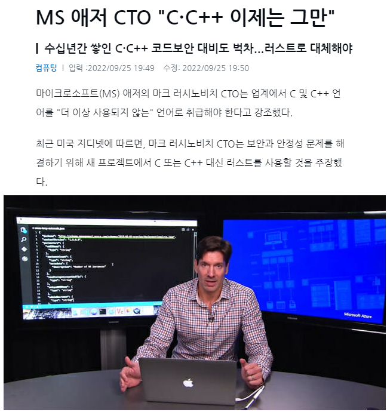
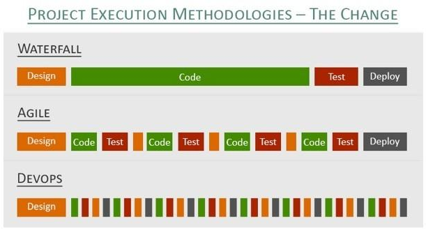
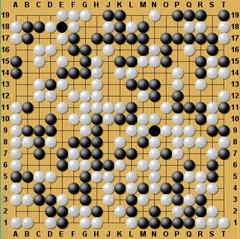
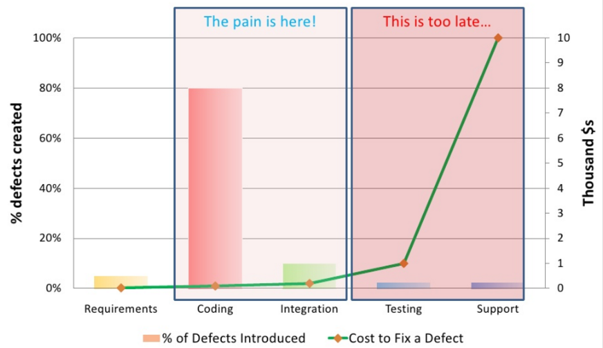

# Zero-Bug Software Development
이 책은 프로그래밍에 대한 이야기가 아니라 소프트웨어가 만들어지는 전체 과정에 대한 이야기입니다.
대상 독자는 개발자 뿐만 아니라 요구사항을 스펙으로 만드는 기획팀,  QA팀, DevOps팀, 프로젝트 매니저(PM), 프로덕트 오너(PO)등 모든 S/W R&D에 참여하는 모든 사람을 대상으로 합니다.

## 0. Preface
### 더 많은 테스트를 더 일찍, 더 빠르게
2022년 SSTC 서울 국제 소프트웨어 테스팅 컨퍼런스의 주제가 "더 많은 테스트를 더 일찍, 더 빠르게"였는데 이 글에서 말하고 싶은 주제도 이와 동일합니다.

버그를 줄이는 방법은 단순히 **더 많은 테스트**를 하는 것입니다.
아무도 몰래 버그가 스며든 시점부터(t1) 버그가 발견되기 까지(t2)의 시간 간격(t2 - t1)이 길면 길수록 고치는 비용이 많이들기 때문에 **더 일찍** 테스트해야 합니다.
또한 테스트 수행 시간이 오래 걸리면 걸릴 수록 변경한 코드에 문제가 없는지 늦게 알게되어 생산성이 낮아지므로 **더 빠르게** 테스트가 수행되어야 합니다.

혹자는 이렇게 반문할 수 있습니다.
> "애초에 버그를 만들지 않는 방향으로 발전해야 하는게 아니냐고"


["C, C++ 이제 그만" - MS Azure CTO](https://zdnet.co.kr/view/?no=20220925182401)


최근 출시된 Rust 언어는 엄격한 문법과 똑똑한 컴파일러를 기반으로 잘못된 주소를 가리키는 메모리 버그 코드는 컴파일 에러를 발생시킵니다.
그러나 Rust 컴파일러가 고객 요구사항 스펙을 만족하는지 알려주지는 않습니다.

2022년 현재 기술로는 다양한 실행 환경에서 발생 가능한 모든 버그를 잡아내는 컴파일러나 AI는 존재하지 않습니다.
이론적으로 모든 경우의 수를 테스트하는 것이야말로 모든 버그를 잡아내는 방법입니다.
다른 말로 말하면 테스트하지 않은 시나리오에는 버그가 숨어있을 가능성이 있다는 것입니다.
개발자는 코드를 추가하거나 변경한 후 성공하는 입력으로만 테스트해보고 나머지 입력에서도 잘 동작하겠지, side effect가 발생할 일은 없어라고 생각하고 배포하면 몇 달 후 고객에게서 버그가 발견되면서 사고가 터집니다.

### Zero-Bug
Zero-bug는 버그가 전혀 없다는 의미가 아니라 버그가 거의 없다는 의미로 사용됩니다.
세상에 버그가 단 한 개도 없는 상용 소프트웨어는 존재하지 않을 수도 있습니다.
그럼에도 불구하고 Zero-bug는 software industry에서 최종 목표이기 때문에 지금도 많은 선구자들이 버그 없는 소프트웨어를 개발하기 위해 연구하고 있습니다.

### 특허 없는 기술
TDD를 처음 제안한 Kent Back, 이를 이어받아 개선시킨 Martin Folwer와 마이클 패더스등은 소프트웨어 개발 방법론에 크게 기여한 선구자들입니다. 이들의 노고에 감사의 말을 전하고 싶습니다.
선구자들이 제안한 방법에는 특허가 없고 이미 많은 빅테크 기업에서 사용하고 있고 그 효과가 검증되었기 때문에 우리는 감사한 마음으로 가져다 사용하면 됩니다.
물론 그것을 제대로 이해하고 개인의 습관과 조직 문화 및 시스템을 바꾸는 일은 뼈를 깍는 노력이 수반되지만 일단 익숙해지기만하면 조직에서 만들어내는 코드 퀄리티는 수공예 방식에서 3D 프린터로 찍어내는 것 만큼 향상될 것입니다.

### 돌도끼에서 망치로
돌도끼에서 망치로 진화한 것 만큼 근래 20년 동안 소프트웨어 개발 방법에 많은 개선이 이루어졌습니다.
20년전 waterfall model로 시작해서 V model을 거쳐 지금은 Agile과 DevOps 방법이 대세를 이루고 있습니다.

미래에는 컴파일 시점에 모든 런타임 버그를 발견해주는 새로운 프로그래밍 언어가 출시되어 테스트를 할 필요가 없는 날이 올 수도 있고, 인간 대신 AI가 버그 없는 완벽한 코드를 생산하는 날이 오거나, Test AI가 알파고 바둑처럼 모든 경우의 수를 시나리오로 만들어서 자동으로 테스트하는 날이 올 수도 있습니다.
그러나 test.ai가 발전하고 있지만 아직은 자율주행처럼 시기상조입니다.

### Agile & DevOps
여기서 소개하는 방법들은 Agile과 DevOps의 핵심 실천 방법들입니다.
즉, Agile로 개발한다는 것은 TDD 방식으로 생산된 unit test code가 CI(Continueos Integration)와 CD(Continues Deployment)의 입력으로 들어가서 test automation 방식으로 매일 테스트를 통과하여 실행 가능한 증분 모듈이 만들어지는 것을 뜻합니다.
Agile의 범위는 여기에서 소개하는 핵심 실천 방법보다 더 광범위하기 때문에 여기에서는 Agile을 소개하는 방식으로 이야기하지 않고 버그를 줄이기 위해 어떻게 해야하는지에 초점을 맞출 것입니다.

**이 책에서 소개하는 topics**
- TDD
- BDD
- Unittest
- CI / CD
- DevOps
- Test Automation
- test.ai

## 1. Human Errors
### 개발자
> - 수천, 수만 라인을 코딩하면서 버그 한 개 없는 소프트웨어를 만들 수 있는 프로그래머가 있을까?
> - 천재적인 프로그래머를 스카우트하면 버그 없는 소프트웨어를 개발할 수 있을까?

프로그래밍 과정에서 버그 주입은 자연스러운 일입니다.
인간은 실수하는 동물이기 때문에 프로그래밍 중에 버그는 생길 수 밖에 없습니다.
실수가 아니더라도 개발자가 인지하지 못한 로직의 흐름이나 예측하기 어려운 dead lock, 고객의 특이한 실행 환경 때문에 개발 과정에서 버그를 발견하지 못하고 모듈을 QA팀에 넘기게 됩니다.

**하인리히의 법칙** 
> 대형 사고가 발생하기 전에 같은 원인으로 수십 차례의 경미한 사고와 수백 번의 징후가 반드시 나타난다는 것을 말한다.

하인리히의 법칙에서 보듯이 참사가 일어나기전까지 버그를 발견하여 고칠 수 있는 기회를 여러번 노쳤을 것입니다.
가장 먼저 놓친 기회는 무엇이었을까요?
코드 변경 후 처음 코드가 실행되었을 때 개발자는 여러가지 테스트를 해보면서 버그를 발견할 기회가 있었습니다.
이 기회가 처음 놓친 기회입니다.

### QA
비단 개발자에게만 책임이 있을까요?
고객에게서 버그가 처음 발견되면 배포를 승인한 QA팀도 책임에서 자유롭지는 못할 것입니다.
QA팀에서 더 꼼꼼하게 테스트하고, 더 많은 test cases를 테스트하고, 더 자주 테스트한다면 zero-bug를 달성할 수 있을까요?
실수를 줄이면 버그도 줄어들겠지만 다음 주에라도 집중력을 잃으면 말짱 도루묵입니다.
개발자와 테스터의 실수를 완전히 제거하고, 실수를 먼저 발견할 수 있는 방법은 없을까요?

### 매뉴얼 테스트의 종말
사람이 손으로 클릭하고 타이핑하는 매뉴얼 테스트는 골방 뒤안길로 가야합니다.
테스터가 필요하지 않다는 말이 아닙니다.
대부분의 테스트는 automation test로 대체하고 QA팀은 탐험적인 테스트(exploratory tests)에 집중해야 합니다.
탐험적 테스트의 목적은 버그 발견 뿐만 아니라 생각하지 못했던 특이한 환경에 대한 테스트 시나리오를 발견하는 것입니다.
그리고나서 이를 자동화 테스트 케이스로 새롭게 추가하는 일을 반복하면서 소프트웨어 퀄리티를 올리고 테스트 커버리지를 넓히는 일에 집중해야 합니다.
어제 통과했던 수천, 수만건의 테스트 케이스를 오늘도 반복 테스트할 수 있도록 시스템을 만들고 고품질을 유지하도록 관리하는 일입니다. 어제 수천건의 테스트를 통과해서 100% inocent한 모듈이라고 하더라도 오늘 수십건의 커밋이 일어나면 소프트웨어 퀄리티는 0% 부터 다시 시작됩니다. 어제 통과한 테스트는 의미가 없고 다시 수천건의 test cases를 통과해야만 합니다.

> **코드가 변경되면 도자기는 깨진다**
> 어제까지 모든 기능이 잘 동작하던 소프트웨어라 하더라도 코드가 커밋되는 순간 0% 퀄리티부터 다시 시작합니다

이렇듯 매뉴얼 테스트로는 매일 수천건의 테스트를 정확히 반복하는게 거의 불가능하기 때문에 테스트를 컴퓨터에게 시키는 방식으로 진화해왔습니다.
공장 생산 라인을 자동화하도록 설계한 후 실제 조립/생산은 로봇이 하는 것과 비슷합니다.
컴퓨터가 테스트를 수행하면 매일 수십만건의 테스트 케이스라도 자동으로 검증되기 때문에 더 많은 테스트를 더 빠르고 더 일찍 그리고 정확하게 테스트할 수 있습니다.

## 2. 버그가 유저에게 전달되는 이유
버그가 유저에게 전달되는 이유는 버그를 먼저 발견하지 못했기 때문입니다.
버그를 줄이려면 우선 모든 시나리오가 코드로 테스트되어야 합니다.
개발자는 코드를 추가, 변경한 후 모듈을 실행해서 성공하는 입력을 넣어보며 테스트하고 정상적으로 동작하면 안도하는 경향이 있습니다. 이미 오랜 시간 많은 버그와 치열히 싸워 이겼기 때문입니다.
성공하는 테스트 케이스에 문제가 없는 것을 확인한 후 QA팀에 모듈을 넘기고 QA팀에서도 운이 나쁘면 버그를 발견하지 못하고 고객이 처음 버그를 발견하게 됩니다. 너무나 익숙한 상황입니다.

개발자와 QA팀에서 다양한 시나리오를 확인해보지 않았기 때문에 버그를 발견하지 못했습니다.
성공하는 케이스 뿐만 아니라 failure cases, exceptional cases, stress cases, edge cases들도 테스트해야 합니다.
그리고 다양한 하드웨어, 네트워크 환경, 데이터베이스에 대한 테스트를 통과한 모듈한 모듈만이 배포될 수 있습니다.
코드가 변경될 때 마다 이런 수천건의 테스트가 수행되어야 매일 커밋되는 코드, 모듈, 소프트웨어 품질을 높게 유지할 수 있습니다.

고객에게 버그가 보고되면 사내에서 버그 원인을 찾기 위해서는 어차피 재현 환경 및 조건을 똑같이 구성해서 재현해 볼 수 밖에 없습니다.
결국 고객이 발견하기 전에 먼저 버그를 발견하면 되는 문제입니다.

> 버그가 유저에게 전달되는 이유는 단지 발견하지 못했기 때문이다


### 테스트 시나리오와 경우의 수
> 208,1681,9938,1979,9846,9947,8633,3448,6277,0286,5224,5388,4530,5484,2563,9456,8209,2741,9612,7380,1537,8525,6484,5169,8519,6439,0725,9916,0156,2812,8546,0898,8831,4427,1297,1531,9317,5577,3662,0397,2470,6484,0935

[바둑판에서 배치 가능한 경우의 수](https://www.a-ha.io/questions/408e574152f2327099f1f53fe4454f4f)는 10의 171제곱의 수입니다. 우주 전체 원자의 갯수 10의 80승보다 훨씬 많습니다.


현실에서 일어날 수 있는 모든 시나리오 경우의 수를 테스트하는 것은 어렵기 때문에 여기에도 전략이 필요합니다.

## 3. 매뉴얼 테스트의 한계
매번 마우스로 클릭하거나 키보드를 두드리는 테스트를 매뉴얼 테스트라고 합니다.
수작업 테스트에는 많은 한계점이 존재합니다.
인간에게 반복적인 작업은 지루하고 실수가 포함됩니다.
코드가 변경될 때 마다 또는 매일 수천건의 테스트를 수행해야 하는데 컴퓨터는 수 십 만번 반복시켜도 실수하지 않으며 100% 정확하고 빠릅니다.

**그렇다면 지금까지 테스트를 컴퓨터에게 시키지 않은 이유는 무엇일까요?**

다양한 이유가 있겠지만 방법을 몰랐거나, 적절한 tool이 없었거나 unittest 작성이 개발을 늦춘다고 생각해서 손으로 빨리 테스트했을 수도 있고, UI 테스트는 자동화 시킬 수 없는 영역이라고 생각했을 수도 있습니다.
지금은 시중에 test automation tool도 충분하고, unittest 도구도 IDE에 내장되어 있으며 CI와 CD를 위한 서비스도 잘 마련되어 있습니다.
빅테크 기업에서는 이러한 DevOps 시스템을 사용하여 개발하고 있습니다.

**DevOps System**
 - MS Azure
 - atlassian

## 4. The Cost of Fixing defects
똑같은 defect 이라도 얼마나 일찍 버그를 발견하느냐에 따라 비용에 차이가 납니다.
시간이 지날 수록 큰 비용을 치르게됩니다.
오래된 defects(버그)일수록 버그 수정 비용이 기하급수적으로 올라갑니다.



제품기획팀에서 스펙 문서를 두리뭉실하게 만들어 개발팀에 전달하면 개발팀에서 스펙을 추측 개발하여 잘못된 기능이 개발되므로 시간과 비용이 낭비됩니다.
코딩 단계에서 버그가 주입된 후 QA팀에서도 버그를 발견하지 못하고 배포하게되면 비용이 많이 듭니다.
**버그를 발견하기** 위해 재현 환경 구축에도 시간이 걸리고
**원인을 찾는** 디버깅에도 시간도 오래걸립니다.
원인을 찾아서 코드 위치를 찾기만 하면 코드 수정은 어렵지 않은 경우가 대부분입니다. (설계에 문제가 있지 않는 이상)
defects이 QA팀에 넘어가면 운이 좋아야 발견됩니다.
개발팀에서 발견되어야 수정 비용이 덜 듭니다.
코드가 추가, 변경된 후 빨리 발견할 수록 수정 비용이 덜 듭니다. 이 부분은 TDD 부분에서 설명합니다.
QA팀에서 운이 나쁘면 defect을 발견하지 못하고 고객에게 전달되어 snowball이 굴러 크게 만들어져 사고가 터집니다.
심지어 아무도 버그가 주입된지 모른채 몇 년 후 사용자로부터 버그가 보고되는 경우도 있습니다.

늦게 발견되었다는 것은 defect age를 말하는 것이 아닙니다.
defect age는 이미 발견된 defect이 fixed 까지 경과된 시간을 말합니다.
발견되지 않으면 defect이 aging되지도 않고 측정되지도 않습니다.

### 소 잃고 외양간 고치기를 반복할 것인가

***가장 큰 비용은 기업 신뢰도 하락***

한번 깨진 신뢰는 다시 쌓기가 힘듭니다.
소 잃고 외양간 고치는 시스템에서 소프트웨어 개발이 계속되면 그나마 남은 소도 가버릴 것입니다.

Apple과 같은 빅테크 기업에서 defect 발생 이유로 이렇게 이야기하는 일은 없습니다.
> 죄송합니다. 이번 장애 원인은 담당 개발자와 QA 인력이 퇴사하여 업무 공백과 노하우 공백이 발생했습니다.

소프트웨어가 만족해야 하는 디테일한 스펙이 동작하는 테스트 코드로 문서화되어 있기 때문에 개발 중에 담당자가 변경되더라도 속도는 느려져도 사고가 터지지는 않습니다. 해당 제품에 대한 테스트 노하우도 동작하는 코드이기 때문에 회사의 자산으로 축적됩니다.

담당자가 교체되면 퀄리티가 떨어지는 기업의 제품과 퀄리티가 계속 축적되는 기업의 제품, 둘 중에 무엇을 선택하시겠습니까?
이제 선택의 문제입니다.


## 5. Testing Strategy
### Testing Hierarchy


Testing에는 전략이 필요합니다.
아래에서 위로(bottom & up) 가장 작은 단위부터 큰 단위로 테스트를 수행합니다.
unit test의 unit은 보통 함수(method or function)를 말합니다.
모든 함수가 unit test를 통과해야만 그 다음 단계 컴포넌트나 모듈, 기능 단위 테스트를 진행할 수 있습니다.
함수가 오동작하는 이상 그 상위 테스트는 진행할 필요가 없습니다.
나무는 뿌리가 튼튼해야 쓰러지지 않는 것처럼 소프트웨어 퀄리티도 unit test 위에 세워집니다.

Manual & Exploratory Tests를 제외하고 모든 하위 테스트는 컴퓨터가 수행하는 것이 좋습니다. UI 테스트도 부분적으로는 자동화가 가능합니다.

## 5. Unittest

모든 함수에 대해 unit test code를 작성해야 할 뿐만 아니라 함수 하나 하나마다 다양한 입력을 넣어 원하는 결과가 제대로 나오는지 확인하기 위해 unit test code를 작성해야 합니다.

예를들어 create_email() 함수를 작성했다면 다양한 입력을 넣어보는 unittest code를 작성해서 예상한 결과가 나오는지 확인해야 합니다.

``` 
bool create_email(string candidate_email)
```

Input | Type
  ------|------
 userA | 성공하는 입력
 "" | 실패하는 입력
 null | 실패하는 입력
 0xFFFF1272 | exceptional input
 "~!@#$%^&*()_+{}|\\/?" | exceptional input


``` go
//함수에 대해서 성공하는 입력, 실패하는 입력, edge 값 입력, 예외를 발생시키는 입력을 넣는 unittest의 예

// 1
func Test_영문숫자입력시_성공하는지() {
    assert.Equal( succeed, create_email("abc123@a.com") )
}
// 2
func Test_숫자를첫글자로입력시_canNotBeNumberFirst_에러나는지() {
    assert.Equal( canNotBeNumberFirst, create_email("123abc@a.com") )
}
// 3
func Test_한글입력시_onlyEnglishError_에러나는지() {
    assert.Equal( onlyEnglishError, create_email("한글@a.com") )
}
// 4
func Test_empty입력시_canNotBeEmpty_에러나는지() {
    assert.Equal( canNotBeEmpty, create_email("") )
}
// 5
func Test_At이없을때_mustIncludeAt_에러나는지() {
    assert.Equal( mustIncludeAt, create_email("abc.a.com") )
}
// 6
func Test_domain에dot이없을때_invalidDomain_에러나는지() {
    assert.Equal( invalidDomain, create_email("abc@a") )
}
// 7
func Test_domain에dot이없을때_invalidDomain_에러나는지() {
    assert.Equal( invalidDomain, create_email("abc@a") )
}
// 8
func Test_특수문자입력시_notAllowSpecialChar_에러나는지() {
    var allowSpecCharTable[] = {'_'}
    var notAllowSpecCharTable[] = {'~', '`', '!', '@', '#', '$', '%', '^', '&', '*', '(', ')', '-', '+', '=', '[', ']', '\', '|', ';', ':', '\'', ',' '<', '.', '>', '/', '?'}
    
    for _, char := range allowSpecCharTable {
        assert.Equal( succeed, create_email(char + "@a.com") )
    }

    for _, char := range notAllowSpecCharTable {
        assert.Equal( notAllowSpecialChar, create_email(char + "@a.com") )
    }
}
```

## 6. TDD
> **버그 생명 주기**
> bug injection -> bug discovery -> bug found -> bug fixed


2022-11-04